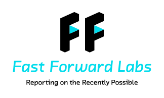
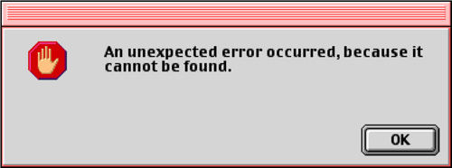
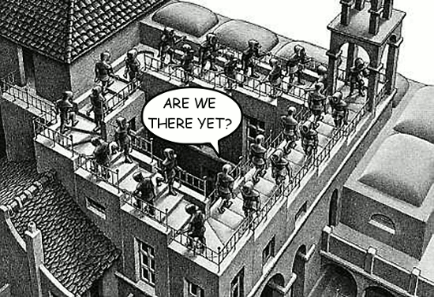
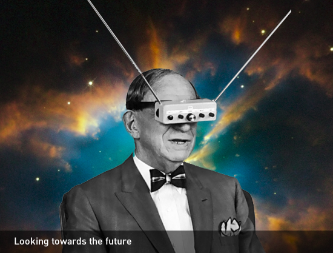
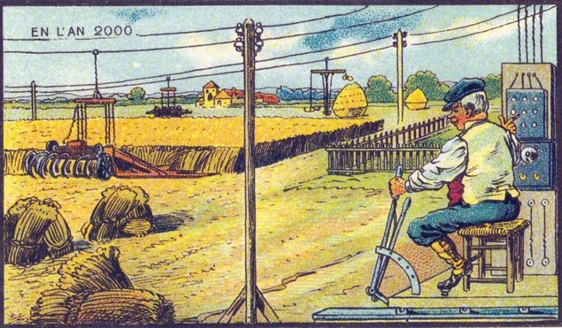
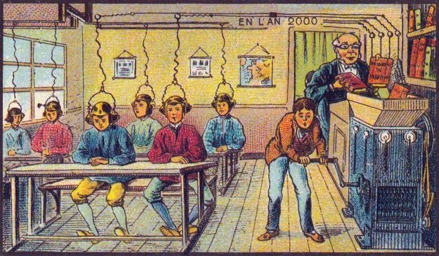

name: inverse
layout: true
class: center, middle, inverse

---

# Science fiction to product:
# Data-driven development
### Micha Gorelick @ Fast Forward Labs
### http://micha.gd/
.footnote[mynameisfiber@(github|twitter)]

---

???

- take algorithms that are becoming useful and explore their uses
- build a prototype, write a report filled with aplications, ethics,
  engineering, commercial, etc..

---

## Natural Language Generation

## Probabilistic Methods for Streams

## Deep Learning for Image Analysis

---

# working with data is _hard_

---

# working with data is _hard_
## unexpected things happen all the time

???

- A project that seems easy can fail for simple reasons
    - bias in the data
    - not enough high quality data
    - needing too much computation
- results are unpredictable
    - even if some academic papers says the contrary

---

# working with data is _hard_
## can't predict the outcome until you try it

???

- it is called "data *science*" after all... your hypothesis can always be wrong
- trying often can take quite a long time
- it's also never quite clear whether you failed or whether you need more time
  to tinker
    - neural networks are notorious for this since they have so many
      hyperparameters
    - still applies for simple things like recommendations systems

---

# working with data is _hard_
## plans and expectations are constantly changing

???

- typically you find a good algorithm by making assumptions on your data, 
    - what if their wrong? 
    - what if they force you to re-evaluate your goals?
- even if you have something that works:
    - data changes as so does the efficacy of your system
    - people change and so do their requirements of your system

---

# like a hound on a trail
## you know you're onto something,   but your not sure what exactly

???

- WE WANT THIS!
- The unknown is good, but scary... you may come back with nothing but it's the
  only place to look for gold
- The hardest part about data engineering is fostering this quest into the
  unknown while still having clear plans

---

# making a product   on top of research?
## challenges just

???

- how to deal with changing understanding of data?
- how can you make a product if you don't know what the results will be like?
- HOW DO YOU PLAN WHEN YOU DON'T... (segway into next slides)

---

background-image: url(images/dummies.jpg)
# no easy way to know the challenges

???

- every project has different challenges that must be solved in unique ways

---

# no clear 'win' conditions

???

- the data has hard 'win' conditions (normally error rates), product has soft
  'win' conditions (is this useful? do people like it?)
- how do you put them together

---

# there's no way to know the answers   but   you *must* know the questions

???

- the best way through these problems is to know when the problem exists
- asking the right questions will help you evaluate when a solution is necessary
- NOTE: some of these questions seem simple, but it's surprising how often we
  use that simplicity to shrug off an answer

---

# step 1: the vision

---

# step 1: the vision
## What super-power can we give people?

???

- "you're going to have to dream a little bigger"
- facebook -> superpower: communicate with all the friends
- 4square -> understand the block you're on
- image recognition -> interact with all your pictures the way you'd expect to
- we want to help our users do something they already do or to do something
  new... but we want to _help_ them do it

---

# step 1: the vision
## How do you know if it's useful?

.footnote.left["giving people the ability to become invisible   when no one is looking
since 2006"]

???

- what is gained?
- what is *lost*?
- are the needs changing? how can you measure that?
- it's easy to come up with new products
    - fav website: we put a chip in it!
- but if we really want to make something of use we want to give superpowers,
  not toys (x-ray glasses instead of x-ray vision)

---

# step 1: the vision
## Have you unintentionally done something _evil?_

???

- ask: what's the most evil thing we could do with this?
- is it worth it to create that possibility?
- even if the application is benign, are the means also good?

---

# step 1: the vision
## <marquee scrolldelay=60 behavior="alternate">HAVE YOU UNINTENTIONALLY DONE SOMETHING _EVIL?_</marquee>

???

- srsly... THINK ABOUT THIS HARD
- spend time understanding the bias in the data you have
- spend time understanding the bias in the models you've made
- spend time trying your application out for different types of people
- example: finding the most profitable loanee
    - may find latent factors in the data that targets high risk people
    - may easily discriminate against minorities
- simpler example: using sentiment analysis to surface certain opinions?
    - even if you have the best of intentions, some algorithms can be real assholes
    - sentiment analysis works on only the most extremes of sentiments
    - *very* biased towards men (see Mike Williams' talk)

---

# step 1: the vision
## How do you know you've succeeded? 

???

- Research can go on forever and you probably don't want your product to turn
  into a phd thesis
- what metric will you use to define when you've adequately solved the problem
- doesn't _have_ to be quantitative... but you do need to be honest about
  what your metric is even if it's subjective -- write it on the wall!
- example: must have 90% accuracy or better
- example: >75% Q/A'd should say it was awesome and no more than 5% say it was
  actively bad

---

# case study: pictograph.us

<video src="images/pictograph.mp4" loop="true" autoplay="true"></video>

---

### case study: pictograph.us
## **superpower?** 
# help people understand their   interaction with images

---

### case study: pictograph.us
## **algorithms?**
# yes and no

---

### case study: pictograph.us
## **data?**
# link to instagram!

---

### case study: pictograph.us
## **evil?** 
# could be in our data retention...  add _full_ and visible delete button

---

### case study: pictograph.us
## **success?** 
# \>80% accuracy quantitatively,   good responses qualitatively

---

# step 2: the research

---

# step 2: the research
## Do we have the data? 

.footnote[can we ethically use it?]

???

- availability of new datasets IMO has been the greatest force helping data
  science
- not easy to answer because the data needed can couple to the methods used
- how clean is the data?
- is the data biased? how?
- do we need to retain the data? for how long?
- at the same time.... (lead in)

---

# step 2: the research
## Do we have the algorithms?

???

- inference? classification?
- Can we learn from other people?
- What's the state of the research and what limitations to academics find?
- as we're playing with the data+algo, we should ask... (lead in)

---

# step 2: the research
## Can we get reliable results?

???

- EXPLORATION!
- this takes quite a while and you MUST have that "win metric" to understand it
- as you are asking this you learn more about the data and the algo
- how robust are the results?
- what do you do when result fails?!!!
- in the same vein.... (lead in)

---

# step 2: the research
## Are there simpler ways of winning?

???

- easy to forget to ask this while in the weeds
- Simplify for understanding
- Simplify for maintaining
- Simplify for deployment

---

# step 2: the research
## How will we deploy this thing?!

???

- Can this run fast enough?
- How do we store the data properly?
- Will we go from winning to losing?

---

# case study: ~~nutritionometer~~
## looking at a failure

---

### case study: ~~nutritionometer~~
## **superpower?** 
# understand the nutritional content of your food

---

### case study: ~~nutritionometer~~
## **data?**
# turns out to be unavailable and noisy

---

### case study: ~~nutritionometer~~
## **metrics?**
# not even the literature could could help

---

### case study: ~~nutritionometer~~
## **algorithm?**
# there were some clear directions,   but no clear solutions

---

### case study: ~~nutritionometer~~
# did we learn? YES

???

- while in retrospect it seems quite simple why this failed, while working on it
  you are always one step away from victory
- were able not to sink too much time by constantly asking ourselves questions
  like:
    - "how is the data?" 
    - "have we thought of a good metric to use?"
    - how are the algorithmic/data compromises we have to make affecting the
      superpower we want to give?
- STILL LEARN FROM FAILING

---

# step 3: the retrospective

???

- never done when working with data... things change

---

# step 3: the retrospective
## Did we succeed in our original goal?

???

- Did you have to change your metrics while developing?
- Why?

---

# step 3: the retrospective
## Are needs changing?

???

- people will use superpowers in ways you never imagined... should you foster
  some of them?

---

# step 3: the retrospective
## Is data changing?

???

- data rarely stays the same on the internet
- methods need to adapt

---

# step 3: the retrospective
## Did we communicate the methods adequately?

???

- "any advanced enough tech looks like magic"...
- we may all be able to open auto doors a second before they should open, but if
  we don't know about it how can we use our superpower?
- do people understand what they are getting?
    - much frustration with data products come from people not understanding how
      hard and how insane the thing that is going on is
    - with better understanding comes better expectations and more robust usage

---

# case study: cliquestream

<video src="images/cliquestream.mp4" loop="true" autoplay="true"></video>

---

### case study: cliquestream
## **superpower**
# understand the dialogue happening in a massive online community

---

### case study: cliquestream
## **algorithms?**
# probabilistic data structures

---

### case study: cliquestream
## **data?**
# no, but we can find some

---

### case study: cliquestream
## **evil?**
# no! privacy is guaranteed

---

### case study: cliquestream
## **success?**
# verify some assumptions  and shed light on new ones

---

# the future

???

- All this is well and good, we care about the future!
- we've all read scifi and wanted that world (unless you read dystopian stuff)

---

# totally true!

.footnote[from the 1900's world fair]

---

# arguably true?

.footnote[from the 1900's world fair]

---

# unfortunately not true.

.footnote[from the 1900's world fair]

---

# where does your idea fall in that spectrum?

todo: different example here
### SUPERPOWER: "computer, make me a sandwich"

---
# where does your idea fall in that spectrum?

### SUPERPOWER: "computer, summarize the internet for me"

---

## it is hard and impossible to understand
# what is *hard but possible*   versus   what *sounds easy but is impossible*

---

## awesome trends
# natural language understanding

???

- getting closer to having conversations with computers
- we can already do this, but only in VERY templated contexts
- causal inference in language is becoming better and better
- inferential understanding of language is getting better to where novel
  concepts be talked about
- could allow us to extract meaningful information from potentially noisy
  sources (ie: transcripts? bills? etc)

---

## awesome trends
# transfer tasks

???

- we're starting to see that neural networks are really learning _general_
  problem solving skills in addition to solving a _specific_ task
- transferring these general skills to new problems is making neural networks
  more easily applicable to a whole host of problems
- teach a NN to identify images, use it to help design aesthetically pleasing
  objects
- teach a NN to classify book genera, use it to write e-mails for you

---

## awesome trends
# graph algorithms

???

- we all want our graph database, but until some basic questions are answered we
  have to keep wishing
- there have been advances in approximate, online graph partitioning algorithms
- will also allow for robust and fast analysis of all sorts of graphs

---

## awesome trends
# q-learning

???

- regulating very complex systems can be tough
    - circuitry
    - games
    - traffic
    - etc.
- q-learning is a model-free method of learning how to make those decisions
- could help humans by helping them analyze their decisions on certain tasks

---

# i'm VERY optimistic   about the future

???

- algorithms are tackling more and more complex questions
- available data is increasing at a staggering rate
- we have the experience necessary to do things

---

### Therefore, keep reading scifi and   making a future you want to live in.

### Love, Micha

---

background-image: url(images/construction.gif)
